# 3-Hour Live Demo Plan: "VibeTree" with Next.js & Firebase App Hosting

This guide outlines the exact copy-paste prompts, commands, and live commentary to build **VibeTree**—a high-end, premium Next.js (App Router) Linktree-like builder application. It features a side-by-side split interface (builder on the left, live glassmorphic mobile-phone preview on the right), stores dynamic assets in **Firebase Firestore/Storage**, authenticates users with **Firebase Auth**, and deploys live via **Firebase App Hosting**.

---

## ⏱️ Live Demo Timeline

```mermaid
gantt
    title 3-Hour VibeTree with Next.js & Firebase
    dateFormat HH:mm
    axisFormat %H:%M

    section Phase 1: Foundations (35m)
    Next.js Setup, Auth, & Firebase Checks :active, 00:00, 35m
    
    section Phase 2: Split-Screen Builder (40m)
    Dashboard UI & Phone Live Preview      : 00:35, 40m
    
    section Phase 3: Firestore & Real-Time (45m)
    Syncing Profile, Themes, & Links        : 01:15, 45m
    
    section Phase 4: Storage & DnD (35m)
    Avatar Uploads & HTML5 Reordering      : 02:00, 35m
    
    section Phase 5: Analytics & Deploy (25m)
    Chart.js Analytics & App Hosting       : 02:35, 25m
```



---

## 🚀 Phase 1: Environment Setup, Auth, & Safety Checks (0:00 - 0:35)

* **Goal**: Initialize a modern Next.js project with Tailwind CSS, Lucide React, and Firebase. Implement a bulletproof Firebase setup check screen when env keys are missing.

### 💻 Step-by-Step Initialization Commands

Run these commands in your workspace root directory:

```bash
# 1. Initialize the Next.js App in non-interactive mode
npx -y create-next-app@latest vibetree --typescript --tailwind --eslint --app --src-dir --import-alias "@/*"

# 2. Enter directory and install required production dependencies
cd vibetree
npm install firebase lucide-react chart.js react-chartjs-2
```

### 📝 Prompt 1: SDK Setup, Routing & Setup Assistant

Create or edit `src/lib/firebase.ts` and the main entry page with this exact prompt:

```text
Setup the Firebase SDK configuration and routing skeleton inside our Next.js App Router project:

1. Create a Firebase initialization file in `src/lib/firebase.ts`. It must check if all required environment variables are present (apiKey, authDomain, projectId, storageBucket, messagingSenderId, appId).
2. Firebase Environment Safety Gate: If any environment variables are missing, do not throw a breaking build error. Instead, export a helper flag `isFirebaseConfigured = false` or catch initialization errors gracefully.
3. If keys are missing, block dashboard routes and display a stunning, step-by-step developer helper page instructing how to configure Firebase, make a Firestore database, enable Storage, and format `.env.local` keys.
4. Setup routing paths:
   - `/` (Home landing page + Firebase Authentication UI for Email/Password and Google Sign-in)
   - `/dashboard` (The split-panel link builder)
   - `/[username]` (The public-facing profile index page)
```

---

## 📱 Phase 2: Split-Screen Builder & Live Phone Simulator (0:35 - 1:15)

* **Goal**: Design the premium split-panel dashboard containing editing controls on the left and a live-updating floating glassmorphic mobile phone frame on the right.

### 📝 Prompt 2: Interactive Split-Panel & Live Preview

Copy and paste this prompt:

```text
Build a responsive, highly premium split-panel layout for the `/dashboard` route:

1. Left Panel (The Builder Controls):
   - A header section to edit Profile Display Name, Bio text (max 160 chars), custom handle, and Theme Presets.
   - An interactive "Links" section allowing users to add new link nodes (with inline Title and URL inputs).
   - Display active feedback when updating (using soft animated spinners and disable indicators during Firestore synchronization).

2. Right Panel (Floating Phone Simulator):
   - A centered, curved-bezel container styled precisely like an iPhone frame with floating glass panels, backdrop blurs (`backdrop-filter: blur(12px)`), and modern radial accent gradients.
   - Inside the phone simulator, dynamically reflect all profile inputs (Avatar, Display Name, Bio, and lists of links with hover scale animations) instantly as the user edits them.
   - Auto-detect Brand Icons: Write a utility function that parses link URLs (e.g. youtube.com, github.com, x.com, instagram.com, linkedin.com) and automatically displays premium SVG brand logos (using lucide-react or custom paths) on the corresponding simulator buttons.
```

---

## 🗃️ Phase 3: Cloud Firestore Sync & Theme Engine (1:15 - 2:00)

* **Goal**: Persist profiles and unique username reservations in Cloud Firestore, and implement a custom multi-theme visual engine.

### 📝 Prompt 3: Firestore Multi-Tenancy & CSS Theme Engine

Copy and paste this prompt:

```text
Implement Firestore real-time synchronization and our custom 4-theme visual engine:

1. Document Writing & Username Guard:
   - When a user saves, persist state using the specified `users` database schema.
   - Enforce lowercase alphanumeric handle checks (`/^[a-z0-9_]{3,15}$/`). Maintain username availability checks inside the `usernames` collection.
2. Dynamic Real-time Listeners: Use `onSnapshot` inside the dashboard to ensure edits sync immediately across multiple active browser sessions without requiring manual page reloads.
3. Build the 4 Custom Theme Layouts:
   - "glassmorphism": Deep Obsidian, transparent white card wrappers, soft cyan/violet glows, custom Google 'Inter' font.
   - "cyberpunk": Jet Black background with neon gridlines, pure black card panels, glowing neon pink/cyan text-shadow borders, custom Google 'Space Grotesk' font, subtle hover text-flicker.
   - "pastel": Warm cream canvas, crisp white card wrappers, very soft sage green/lilac accents, elegant serif 'Playfair Display' headings, smooth lifted transition shadows.
   - "brutalism": High-impact banana yellow canvas, solid white cards with thick 4px solid black borders, heavy blocky Google 'Syne' font, and offset flat black shadows (`4px 4px 0px #000`) that translate $-4px$ on hover.
4. Mount the public profile at `src/app/[username]/page.tsx` utilizing Server-Side rendering and the Next.js `generateMetadata` API to output custom OpenGraph/Twitter SEO tags (`og:title`, `og:description`, `og:image`).
```

---

## 📷 Phase 4: Avatar Uploads & Standard Drag-and-Drop (2:00 - 2:35)

* **Goal**: Configure Firebase Storage uploads with file verification, and code standard HTML5 draggable lists for link reordering.

### 📝 Prompt 4: Storage Upload & HTML5 Reordering

Copy and paste this prompt:

```text
Let's add profile avatar uploads and HTML5 list row reordering:

1. Storage Avatar Upload:
   - Add a file input selector for the profile photo. Confirm files are < 2MB and match standard image MIME types (`image/*`).
   - Compress and upload files to Firebase Storage at `/avatars/{uid}/profile.webp` and save the download URL to the user's Firestore document.
   - Render optimized profile images across VibeTree using the Next.js `<Image />` component with custom sizes, aspect ratios, and blur overlays to avoid Layout Shifts (CLS).
2. HTML5 Drag-and-Drop:
   - Implement native HTML5 draggable attributes on link builder rows inside the dashboard.
   - Allow users to drag, hover, and drop rows to reorder lists smoothly.
   - On dropping, recalculate the array order index, instantly animate the changes inside the phone simulator, and write the newly sorted list directly back to Cloud Firestore.
```

---

## 📊 Phase 5: Click Telemetry & App Hosting Deployment (2:35 - 3:00)

* **Goal**: Integrate granular click tracking inside Firestore, render analytical charts via Chart.js, and configure Firebase App Hosting for live deployment.

### 📝 Prompt 5: Analytical Graphics & App Hosting Configurations

Copy and paste this prompt:

```text
Conclude the application with analytic graphs, local security rule files, and live deployment settings:

1. Click metrics: Increment click counts inside the Firestore subcollection `users/{uid}/analytics/{linkId}` when users click on active links inside the mobile-phone preview.
2. Render responsive Chart.js components inside an "Analytics" tab on the dashboard showing click performance timeline history using beautiful matching purple/indigo radial gradients.
3. Local Security Rules Configuration: Create local `firestore.rules` and `storage.rules` files using the specified security architecture configurations from Part 1.7 of our PRD.
4. Configure the `firebase.json` settings, mapping `firestore.rules` and `storage.rules` to their respective deployment pipelines, ready for Next.js App Hosting and production environment variables.
```

### 💻 Live CLI Commands: Deploying Next.js to Firebase App Hosting

Guide the audience through configuring Firebase App Hosting to deploy their server-side Next.js App Router project:

#### 1. Install or Update Firebase CLI

```bash
npm install -g firebase-tools
```

#### 2. Initialize App Hosting Config

In the project root, run:

```bash
firebase login
firebase init apphosting
```

* **What to select during `init`:**
  * Select your active Firebase Project.
  * Choose your preferred hosting region (e.g. `us-central1`).
  * Select your GitHub repository containing the **VibeTree** Next.js project.
  * Configure automatic builds on every git push (highly recommended for Next.js).

#### 3. Push and Verify

Once initialized, push your code to your GitHub main branch. Firebase App Hosting will automatically trigger a cloud-build, compile your Next.js project, optimize server-side renders, and spin up an active hosting domain (e.g., `https://vibetree-app.web.app`) to share live!
